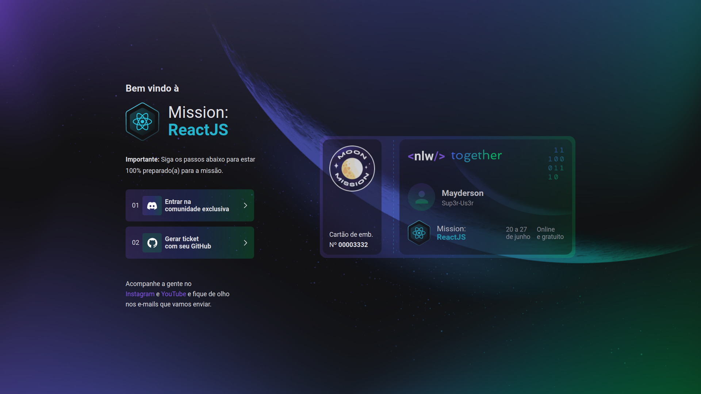

<p align="center">
  

  
</p>

---

<p align="center">
  <a href="#-technologies">Technologies</a>&nbsp;&nbsp;&nbsp;|&nbsp;&nbsp;&nbsp;
  <a href="#-project">Project</a>&nbsp;&nbsp;&nbsp;|&nbsp;&nbsp;&nbsp;
  <a href="#memo-license">License</a>
</p>

<br>

<p align="center">
  
</p>

## 🚀 Technologies

This project was developed with the following technologies:

- [Next.js](https://nextjs.org)
- [TypeScript](https://www.typescriptlang.org)

## 💻 Project

Rocketseat page clone that generates a ticket for NLW made with NextJS and TypeScript

## Getting Started

First, install all dependencies:

```bash
npm install
# or
yarn install
```

Run application

```bash
npm run dev
# or
yarn dev
```

Open [http://localhost:3000](http://localhost:3000) with your browser to see the result.

## :memo: License

This project is under the MIT license. See the file [LICENSE](LICENSE) for more details.
